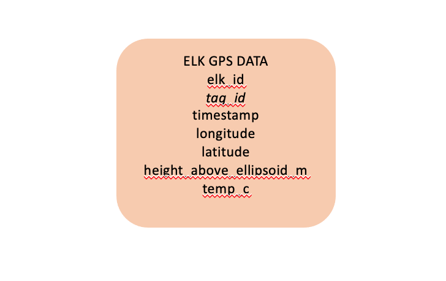

# Database Structure and Creation {#chapter2}


## Description of structure

I structured my database (*see image below*) with only one table because 
of the simplicity of the elk movement dataset. This GPS table contains all the 
raw telemetry data from the elk and a few other variables that were collected.


### **Database Diagram** 
```{r figure, echo=FALSE, fig.align='center', fig.cap="Image of simple database structure (single table) of elk movement"}

```


## Building the Database

First, to build the database using RSQLite, I will install the packages necessary for analyzing the data.
```{r packages, echo=TRUE, eval=FALSE}
install.packages("DBI")
install.packages("tidyverse")
install.packages("lubridate")
install.packages("ggmap")
```

```{r library, echo=TRUE, eval=TRUE}
library(DBI)
library(tidyverse)
library(lubridate)
library(ggmap)
```


Next, I will need to connect to the created database (already in SQLite). 

```{r connect, echo=TRUE, eval=TRUE}
elk_db <- dbConnect(RSQLite::SQLite(), "/Users/Megan/Desktop/Rep_Sci/Elk_Movement_Project/elk_movement.db")
```

I am able to create queries by using the R syntax code below:

```{r query, echo=TRUE, eval=FALSE}
dbExecute(elk_movement_db, "CREATE TABLE elk_gps_data (
elk_id varchar(4) NOT NULL,
tag_id varchar(7) NOT NULL,
longitude double,
latitude double,
timestamp double,
temp_c float,
height_above_ellipsoid_m float,
PRIMARY KEY (tag_id)
);")
```

**However, the table is also already created within my database through SQL**

I can link to the query and pull in the table:
```{r link, echo=TRUE, eval=TRUE}

gps <- dbGetQuery(elk_db, "SELECT * FROM elk_gps_data;")
```

I can look at the structure of my data to check that it is indeed a data frame 
and see what the top few rows look like:
```{r structure, echo=TRUE, eval=TRUE}

class(gps)
```

```{r head, echo=TRUE, eval=TRUE}
head(gps)
```


It looks like the top row is a repeat of column headers, so I can remove that.
```{r remove, echo=TRUE, eval=TRUE}
gps <- gps[-1, ]
```

Finally, I will need to convert most of the columns into numeric since they were
pulled into R as character:
```{r convert, echo=TRUE, eval=TRUE}
gps$height_above_ellipsoid_m = as.numeric(gps$height_above_ellipsoid_m)
gps$longitude = as.numeric(gps$longitude)
gps$latitude = as.numeric(gps$latitude)
gps$temp_c = as.numeric(gps$temp_c)
```


Now, I can look at the actual number of individuals collared. It looks like we 
have about 98 elk in the dataset so multiple collars (tags) were put on the same
elk in some instances. 
```{r unique, echo=TRUE, eval=TRUE}
gps %>% 
  select(elk_id) %>% 
  unique() %>% 
  head()
```  

And 170 tags.
```{r tags, echo=TRUE, eval=TRUE}
gps %>% 
  select(tag_id) %>% 
  unique() %>% 
  head()
```


