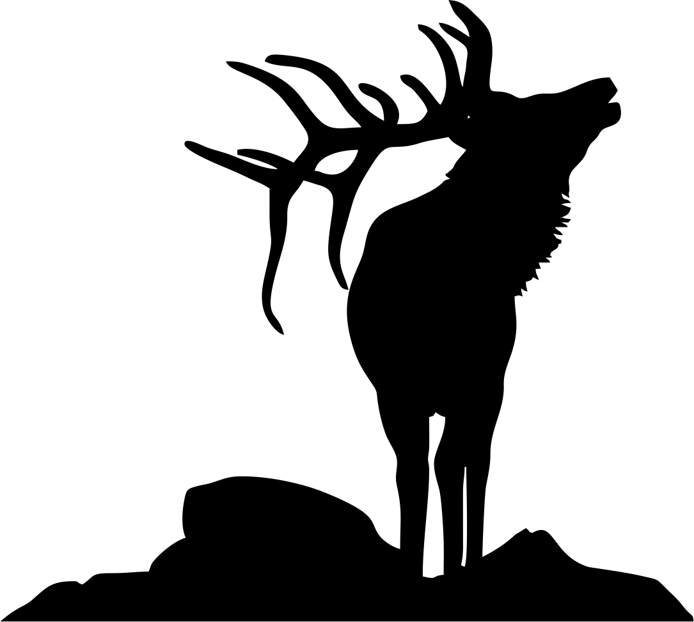

--- 
title: "Analyzing Elk Movement Ecology Using GPS Collar Data"
author: "Megan Whetzel"
date: "`r Sys.Date()`"
site: bookdown::bookdown_site
documentclass: book
bibliography: [book.bib, packages.bib]
biblio-style: apalike
link-citations: yes
description: "This is my final project website."
---

# Introduction

```{r elk, echo=FALSE, fig.align = 'right', out.height = '40%', out.width= '40%', fig.cap="https://www.etsy.com/listing/625557880/bugling-elk-decal"}

```

My project will be looking at elk (*Cervus elaphus*) GPS collar data collected 
in southwestern Alberta, Canada. This particular study looked at elk behavior and 
compared it to their movement. I was able to download this data from MoveBank 
(a website for publicly available data) and will use this dataset as a surrogate 
for data I collect in the coming two years while completing my Master's degree. 
I will be analyzing ungulate (elk, deer (*Odocoileus* spp), and livestock) 
movement through and usage of wildfire-burned areas so this telemetry data
was very useful for practicing my analysis skills.

I plan to use the elk ID to ensure points are matched to each individual elk and 
their corresponding location data. This is captured in latitude/longitude. These
points have a timestamp as well as the ambient temperature and elevation 
captured as the height above the ellipsoid recorded at the time of the location 
being taken. 

I will focus on using the telemetry locations and other covariates to plot elk 
movement and answer questions about their ecology captured from the collars. 

## Project Goals

I will answer these few questions:

1. How does ambient temperature change across the study site and what 
temperatures did elk have to withstand in Southwestern Alberta?

2. How are elk using the landscape individually and in relation to other 
collared elk?

3. And, to expand upon the first question: Which locations are elk using more
frequently?


## Project Outline

This book contains the following chapters:

Chapter \@ref(chapter2): Database Structure and Creation

Chapter \@ref(chapter3): Temperature

Chapter \@ref(chapter4): Elk Movement 

Chapter \@ref(chapter5): Elk Usage of the Landscape

Chapter \@ref(chapter6): References

